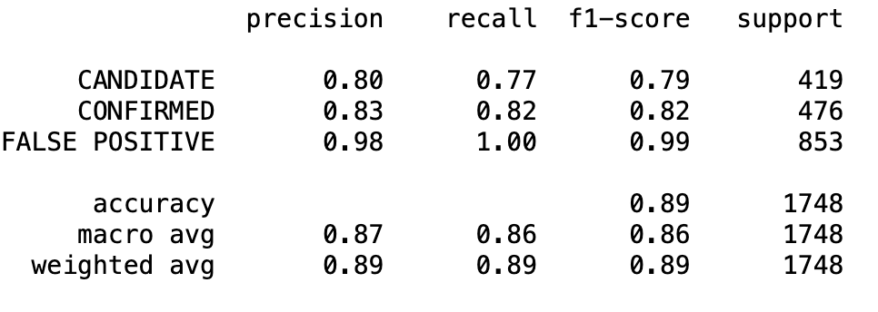
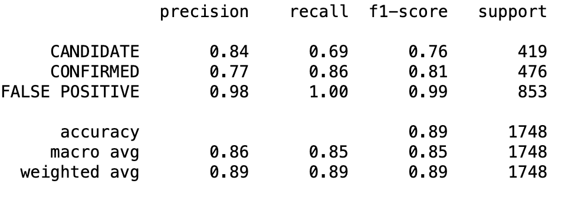
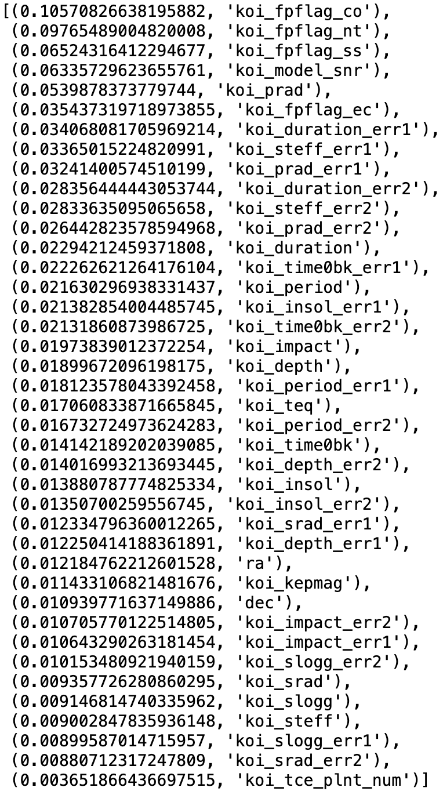

# Assumptions and Findings

## The most accurate model created was a random forest using gridsearch for tuning:

## The SVM model had a similar accuracy in its predictions:

The main difference in these predictions was that the random forest model was able to more accuractely predict confirmed exoplanets with an 83% accuracy as opposed to 77% with the SVM model. Overall, the random forrest model had a better f1-score in all three categories of candidate, confirmed and false positives.

# Feature Importance

The top 3 important features:

**1. koi_fpflag_co**

The source of the signal is from a nearby star, as inferred by measuring the centroid location of the image both in and out of transit, or by the strength of the transit signal in the target's outer (halo) pixels as compared to the transit signal from the pixels in the optimal (or core) aperture.

**2. koi_fpflag_nt**

A KOI whose light curve is not consistent with that of a transiting planet. This includes, but is not limited to, instrumental artifacts, non-eclipsing variable stars, and spurious (very low SNR) detections.

**3. koi_fpflag_ss**

A KOI that is observed to have a significant secondary event, transit shape, or out-of-eclipse variability, which indicates that the transit-like event is most likely caused by an eclipsing binary. However, self-luminous, hot Jupiters with a visible secondary eclipse will also have this flag set, but with a disposition of PC.
-----------------------------------------------------------------------------------------------------------------------------

The strongest indicator is is koi_fpflag_co which is the strength of the signal of the object as it transitions from the outer rim of the star to its center. The 2nd and 3rd strongest indicator are those objects which have lightiing that is not usual in exoplanets. This two are factors used as evidence that it is not an exoplanet but other stars.

It appears that data that supports the non-existence of exoplanets can strongly improve a model's prediction that there are exoplanets.

## Features of Importance (descending):

